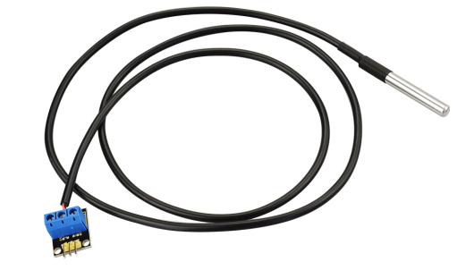
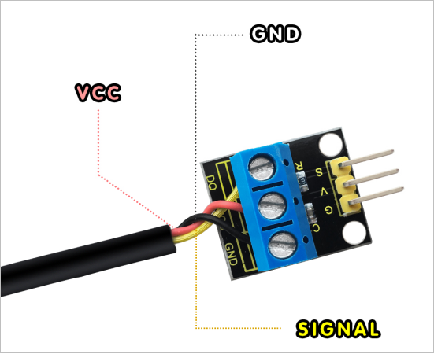
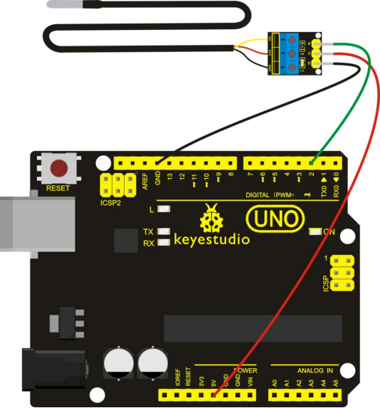
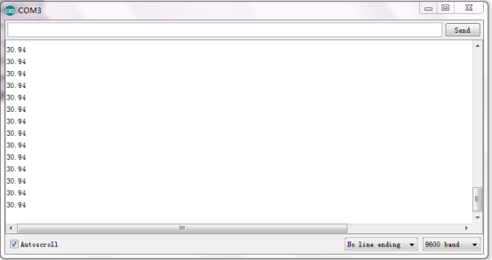
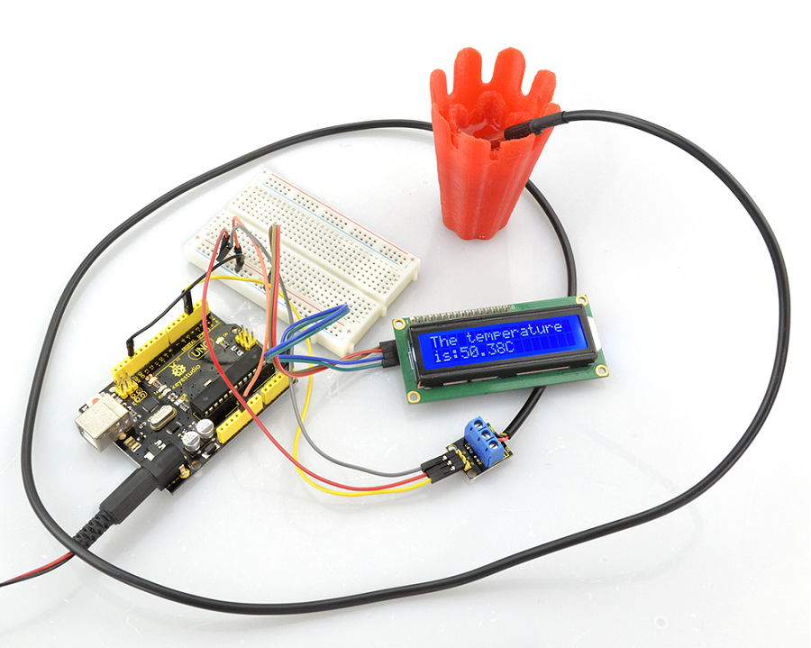

# KS0316 Keyestudio DS18b20 Temperature Detector Sensor (Black and Eco-friendly)



## 1. Description

Keyestudio DS18b20 temperature detector probe adopts the brand-new original DS18B20 temperature sensor chip.

Each pin of chip is separated by heat shrinking tube to prevent the short circuit, and sealed inside for waterproof and damp-proof. Its direct "One line Bus" digital transmission greatly improves the anti-jamming capability of system, suitable for field temperature measurement in harsh environments.

At the same time, it is sealed with a high thermal conductivity of sealing rubber strip, to ensure the temperature sensor’s high sensitivity, with a very tiny temperature delay. Its measured temperature range is from -55℃ to +125℃, in the range of -10℃~ +85℃, its accuracy is±0.5℃.

Compared with other DS18B20 temperature detector sensors, ours has added a switching module, so just need to connect the G, V, S pin of module when test it, pretty easy and simple.




If without this switching module, in testing, need to connect the signal end (yellow line) of sensor to the Digital port of microcontroller, meanwhile, also need to add a pull-up resistor on the Signal end, or else the test will fail.

## 2. Parameters

- Each pin of chip is separated by heat shrinking tube to prevent the short-circuit
- Sealed with premium stainless steel tube for waterproof, damp-proof and rustproof.
- Total length of 1m
- 3.3-5V power supply
- 9~12 bit adjustable resolution
- Temperature sensing range: -55℃~+125℃（lead wire can bear the temperature up to 85℃）


## 3. Connection Diagram

You can refer to the following connection. For UNO board and pressure sensor, connect the S pin of sensor to A0, negative pin to GND, pasitive pin to 5V.



## 4. Sample Code

Download Resources:   [Resources](./Resources.7z)

```c
#include <OneWire.h>
 int DS18S20_Pin = 2; //DS18S20 Signal pin on digital pin 2
 //Temperature chip i/o
OneWire ds(DS18S20_Pin);  // on digital pin 2

void setup(void) 
{
  Serial.begin(9600);
}

void loop(void) 
{
  float temperature = getTemp();
  Serial.println(temperature);  
  delay(100); //to slow down the output so it is easier to read   
} 

float getTemp()
{
  //returns the temperature from one DS18S20 in DEG Celsius 
  byte data[12];
  byte addr[8];
  if ( !ds.search(addr)) 
  {
      //no more sensors on chain, reset search
      ds.reset_search();
      return -1000;
  } 
  if ( OneWire::crc8( addr, 7) != addr[7]) 
  {
      Serial.println("CRC is not valid!");
      return -1000;
  }
  if ( addr[0] != 0x10 && addr[0] != 0x28) 
  {
      Serial.print("Device is not recognized");
      return -1000;
  }
  ds.reset();
  ds.select(addr);
  ds.write(0x44,1); // start conversion, with parasite power on at the end
  byte present = ds.reset();
  ds.select(addr);    
  ds.write(0xBE); // Read Scratchpad   
  for (int i = 0; i < 9; i++) // we need 9 bytes
  { 
  	data[i] = ds.read();
  }
  ds.reset_search();   
  byte MSB = data[1];
  byte LSB = data[0];
  float tempRead = ((MSB << 8) | LSB); //using two's compliment
  float TemperatureSum = tempRead / 16;
  return TemperatureSum;  
}
```

## 5. Example Result

Wire it up well as the above diagram, upload the above code to the board, then click to open the serial monitor, and set the baud rate as 9600, finally you will see the temperature value of current ambient. Shown as the figure below.



## 6. Further

For further study, you can direct to add a 1602 LCD to display the temperature of water. As shown below.

